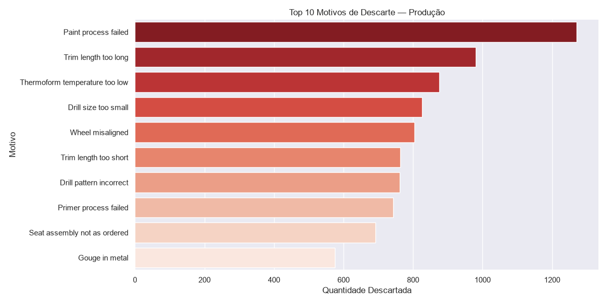
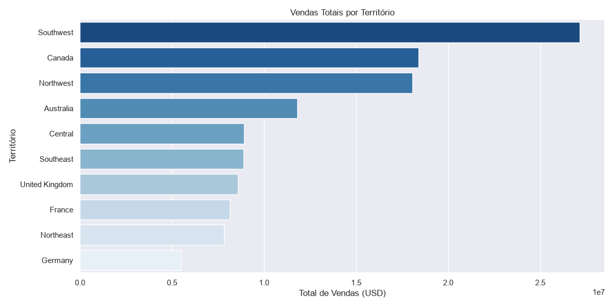
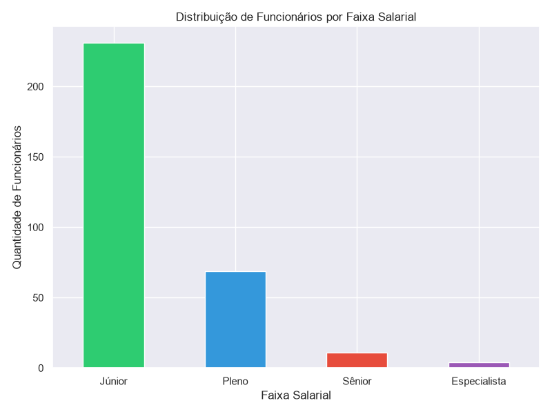

# 📊 AdventureWorks Analytics Pipeline

Pipeline de extração, tratamento e visualização de dados construído com Python e SQL Server, usando o banco de dados AdventureWorks2025 como fonte de dados.

## 🎯 Objetivo

Simular o dia a dia de um analista de dados — desde a extração de dados brutos até a geração de insights nas áreas de Produção, Vendas e RH.

## 🛠️ Tecnologias utilizadas

- **Python 3.14** — automação e orquestração do pipeline
- **SQL Server** — banco de dados relacional (AdventureWorks2025)
- **pyodbc** — conexão entre Python e SQL Server
- **Pandas** — manipulação e enriquecimento dos dados
- **Matplotlib + Seaborn** — visualizações e gráficos
- **Git + GitHub** — versionamento do código

## 📁 Estrutura do projeto
## 📦 Dados extraídos

| Área | Registros |
|------|-----------|
| Produção | 729 |
| Vendas | 31.465 |
| RH | 316 |

## 📊 Visualizações geradas

### Top 10 Motivos de Descarte — Produção


### Vendas Totais por Território


### Distribuição por Faixa Salarial — RH


## 🚀 Como executar

1. Clone o repositório
2. Tenha o SQL Server com AdventureWorks2025 instalado
3. Instale as dependências:
```bash
pip install pyodbc sqlalchemy pandas matplotlib seaborn
```
4. Execute os scripts em ordem:
```bash
python extracao.py
python tratamento.py
python graficos.py
```

## 📌 Próximos passos

- [x] Extração de dados com Python + SQL
- [x] Tratamento e enriquecimento com Pandas
- [x] Visualizações com Matplotlib/Seaborn
- [ ] Dashboard no Looker Studio
